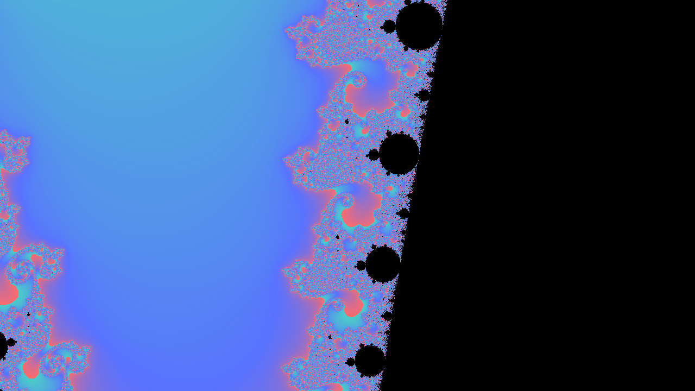
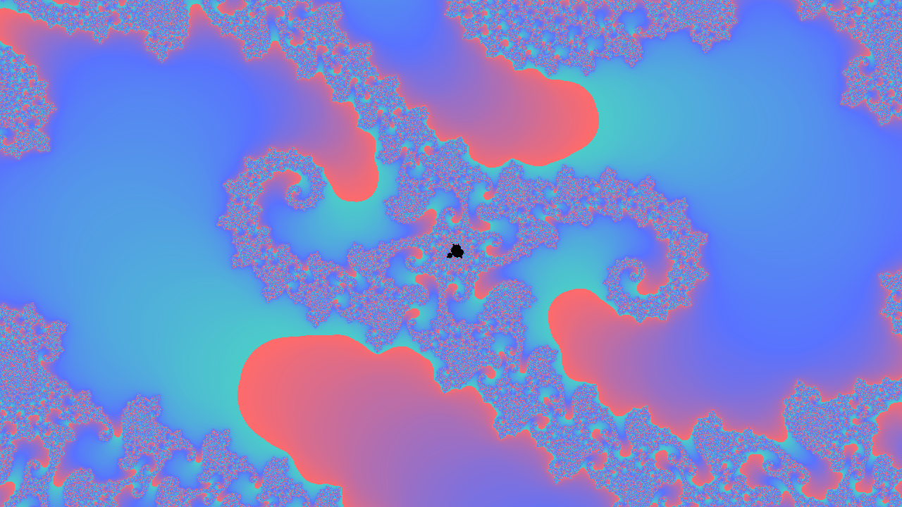
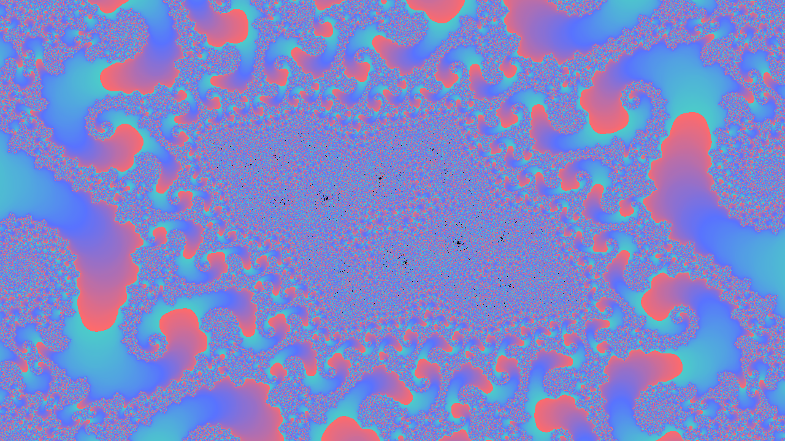
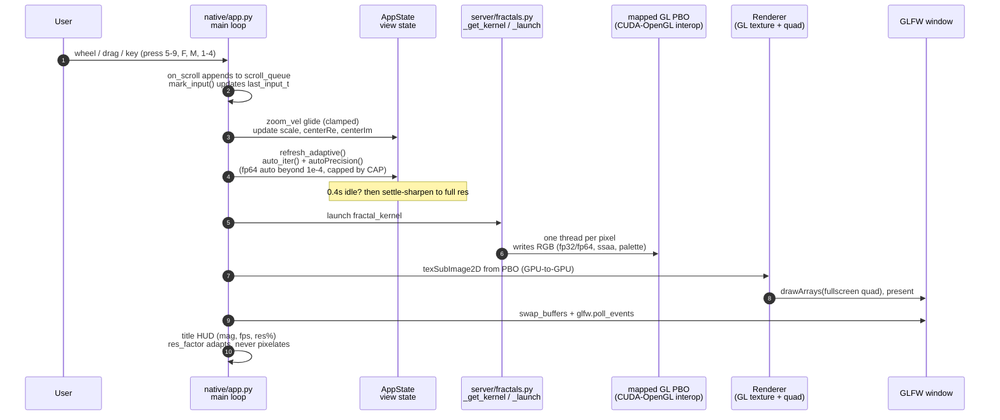
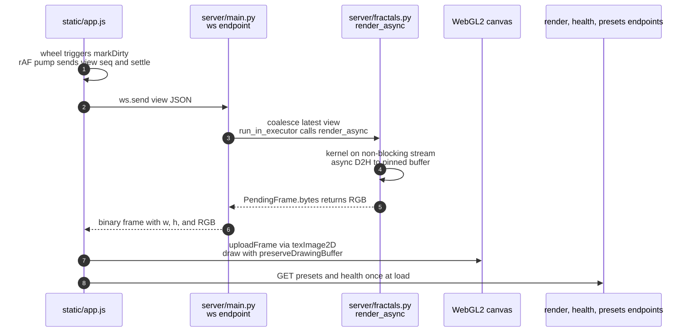

# fractals-with-cuda

Real-time Mandelbrot & Julia explorer rendering **every pixel with raw CUDA kernels** — a native desktop app (GLFW + OpenGL + CUDA-GL interop, zero frames leave the GPU) with a WebGL2 web version alongside.

   

## Screenshots

| Seahorse Valley | Seahorse Deep (fp64, ×17,000) | Seahorse Abyss (fp64, ×34 billion) |
|---|---|---|
|  |  |  |

## Two ways to run

> **First: get inside the project folder.** Every command below must run from
> the repo directory — `uv pip install -e .` and `python -m native.app` only
> work there (that's where `pyproject.toml` and the `native/` package live).
>
> If you don't have the repo yet:
> ```powershell
> git clone https://github.com/uvwxe/fractals-with-cuda.git
> cd fractals-with-cuda
> ```

### Native app (recommended — faster, no browser)

The CUDA kernel writes **straight into a GPU-mapped OpenGL buffer** — the frame never touches the CPU, so zoom is ~45fps at full resolution, pixel-perfect, on vsync.

```powershell
cd C:\path\to\fractals-with-cuda   # or just: cd fractals-with-cuda
uv venv --python 3.12 .venv
uv pip install -e .
.venv\Scripts\python.exe -m native.app
```

### Web version

```powershell
cd C:\path\to\fractals-with-cuda
uv pip install -e .
.venv\Scripts\python.exe -m uvicorn server.main:app --host 127.0.0.1 --port 8000
```
Open http://127.0.0.1:8000

## What it does

- **Raw CUDA kernels per pixel** — Mandelbrot + Julia, smooth coloring (fixed ~20-iteration palette cycling), in-kernel 2×2 supersampling. JIT-compiled at runtime via NVRTC (no CUDA Toolkit install needed).
- **Native CUDA-OpenGL path** — mapped PBO + GPU-to-GPU texture upload + sync-per-frame. No device→host transfer. Verified pixel-exact against a host reference across 49k pixels and 60-frame alternating-view bursts.
- **fp32 interactive** (~45fps full-res motion) and **fp64 deep zoom** (auto-engages past ×34,000) with automatic resolution/iteration scaling.
- **Capability scaling** — the app probes the GPU's compute capability at startup and tunes itself (iterations, motion resolution, depth) so a strong card gets sharper and deeper, a weak card stays smooth.
- **~45fps continuous zoom** with velocity glide, zoom-to-cursor, drag pan, right-click → Julia seed, animated fly-ins to preset locations.
- **4 palettes** (Thermal, Mono, Classic, Sunset), iteration control, reset.

## Controls (native app)

| Action | Input |
|---|---|
| Zoom | wheel (velocity glide, zoom-to-cursor) |
| Pan | drag |
| Julia seed | right-click (Mandelbrot mode) |
| Mandelbrot / Julia | `M` |
| Palettes | `1`–`4` |
| fp32 / fp64 | `F` |
| Supersampling | `S` |
| Iterations | `Up` / `Down` |
| Reset fly-in | `R` |
| Presets (boundary hotspots) | `5`–`9`, `0` = Seahorse Abyss |
| Bookmark view / go to bookmark | `B` then `0`–`9` / `G` then `0`–`9` |
| Save PNG screenshot | `P` (writes to `shots/`) |
| Quit | `Esc` |

## Presets

`5` Seahorse Valley · `6` Elephant Valley · `7` Triple Spiral · `8` Satellite Minibrot · `9` Seahorse Deep (fp64) · `0` **Seahorse Abyss (×34 billion)** — plus the web version has 14 verified presets.

## How deep can it go?

The fp64 kernel renders genuine fractal structure down to **scale 1e-14 — about ×340 TRILLION
magnification** (verified: 460+ distinct colors at 1e-9, 1e-11 and 1e-13 at the Seahorse Deep
boundary point). An earlier claim that double precision "collapses at 1e-8" was a measurement
artifact — testing at a uniform-coordinate spot, not a real boundary.

The app's zoom floor is 1e-14; the `0` key flies to "Seahorse Abyss" (scale 1e-10), and `9`
to "Seahorse Deep" (2e-4). Beyond 1e-14 you'd need arbitrary-precision CPU math or
double-double GPU arithmetic — genuinely a different project.

## Benchmarks (RTX 3050 Laptop, 4 GB)

| Mode | Cost |
|---|---|
| fp32 motion (full iters, 1280×720) | ~44 ms/frame (~23 fps)** |
| fp64 motion (6000 iters, 768px upscaled) | ~30 ms/frame (~33 fps) |
| Kernel (fp32, 1080p, 400 iters) | ~0.3 ms |

** sync-per-frame costs ~20 ms on Windows WDDM; the kernel itself is ~0.3 ms. That's the honest ceiling for browser+CUDA sharing a GPU.

## Test suite

Run from the project folder (same `cd` rule as above):

```powershell
# native pipeline: renders through the real GL interop path, pixel-exact check
.venv\Scripts\python.exe -m native.app --selftest

# interactive simulation: scripted zoom/drag/deep sessions, reports fps/hitches/pixels
.venv\Scripts\python.exe -m native.simtest

# screenshot generator (Seahorse Valley + Deep)
.venv\Scripts\python.exe scripts\screenshot.py
```

## Architecture

- `native/app.py` — GLFW window, OpenGL present loop, CUDA-GL interop, inputs, adaptive resolution, capability probing
- `native/interop.py` — ctypes glue to the CUDA runtime for `cudaGraphicsGLRegisterBuffer` / map / unmap (bundled with CuPy — no CUDA Toolkit)
- `server/fractals.py` — the raw CUDA kernel source (fp32 + fp64 variants of one source), palettes, presets
- `server/main.py` — FastAPI: `/render`, `/ws` (streaming WebSocket renders), `/health`, `/presets`
- `static/` — vanilla JS + WebGL2 frontend (no build step)

## How a zoom request flows

### Native app (the main experience)



### Web version (FastAPI + WebSocket streaming)



